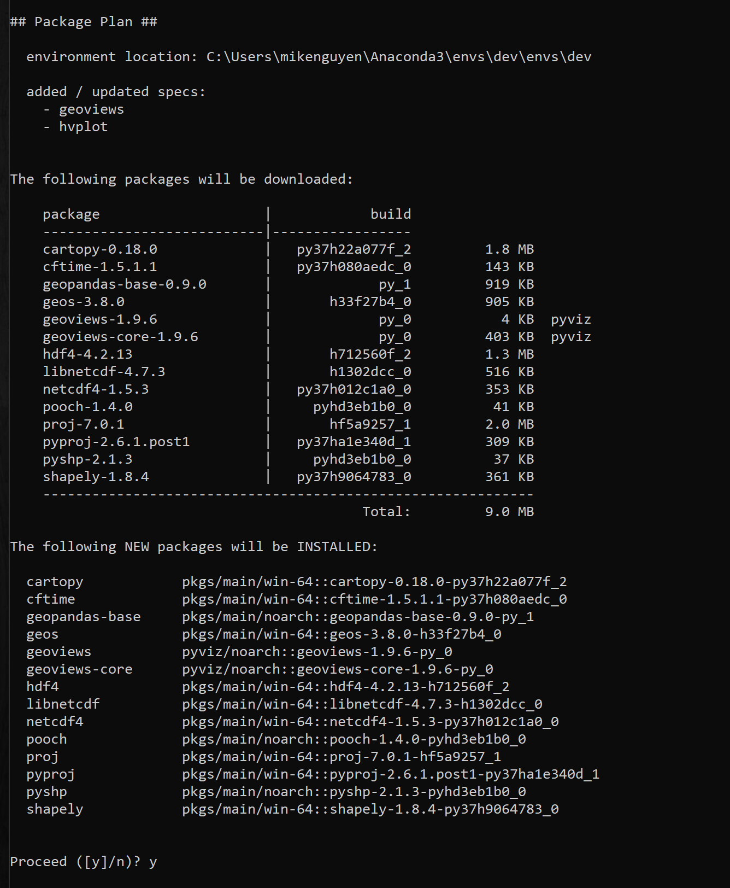
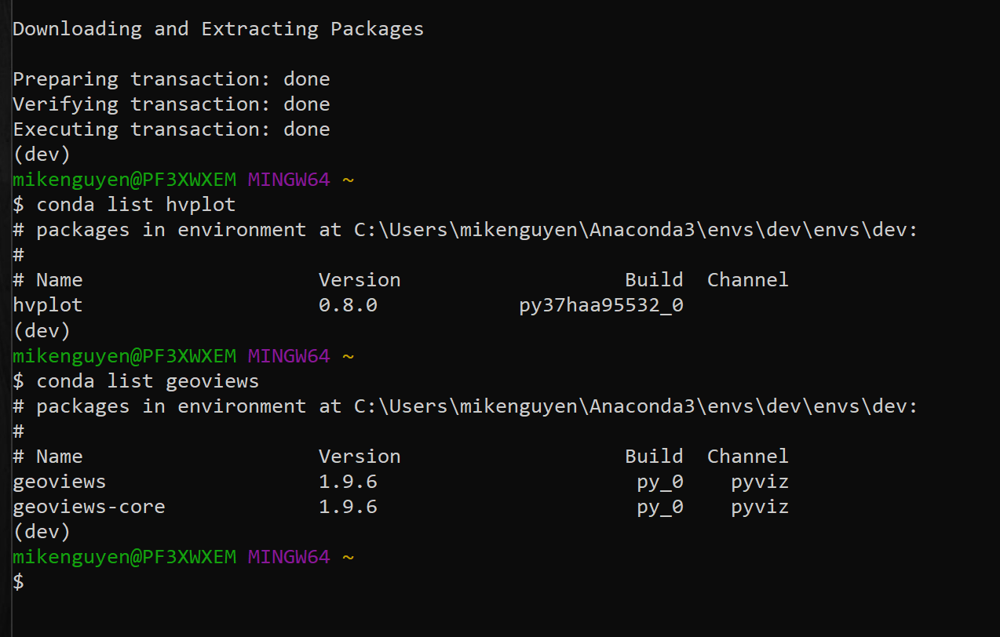

# SF Housing Visual Analysis

This Jupyter notebook contains code that automates a quantitative analysis using statistical algorithms to evaluate investment options for inclusion into client portfolios based on key risk-management metrics: the daily returns, standard deviations, Sharpe ratios, and betas. The analysis includes four new investment options (Soros, Tiger Global, Berkshire Hathaway, & Paulson) for inclusion in the client portfolios compared to the S&P 500 Index.

## Technologies

Programming Language: Python 3.7.13

Interactive Development Environment: JupyterLab


Libraries: 
- Pandas - A Python library that is used for data manipulation, analysis, and visualization. 
- Pathlib - A Python module that provides an object-oriented interace to working with files & directories.
- Numpy - A Python library that is used for scientific computing and data analysis and provides a number of mathematical functions that can be applied to large sets of numerical data such as linear algebra operations, Fourier transforms, and random number generation. 
- Matplotlib - A Python for creating static, animated, and interactive visualizations in Python. It provides a wide variety of customizable visualizations, including line plots, scatter plots, bar plots, histograms, heatmaps, and more.
- PyViz - A Python-based open-source visualization framework that provides a suite of tools for creating interactive visualizations of data, including several libraries like hvPlot and GeoViews.


Operating System(s):  Any operating system that supports Python, including Windows & macOS.

## Installation Guide

To run this analysis, make sure you install the necessary dependencies:

1. Install Python: https://www.python.org/downloads/
2. Install and run Jupyter Lab:  https://jupyter.org/install
3. Install the necessary libraries using pip, the package installer for Python:
```
pip install pandas pathlib numpy matplotlib
```
4. Install the PyViz packages by using the conda install command as follows:
```
conda install -c pyviz hvplot geoviews
```
The following image shows the packages to be installed:



5. Confirm the installation of all the PyViz packages by running the following commands:
```
 conda list hvplot
 conda list geoviews
```
The following image shows the responses, which list the installed packages.

IMPORTANT
Make sure to use hvPlot version 0.7.0 or later.



6. Clone the repository: `git clone "https://github.com/mikenguyenx/6_sf_housing_pyviz"` using git or download the ZIP file and extract it to a local directory.


## Usage

To run the script for the Fund Portfolio Risk Return Analysis:

1. Open a terminal or command prompt and navigate to the directory with the analysis.
1. Launch Jupyter Lab: jupyter lab
2. Open `XXXX.ipynb` in Jupyter Lab.
3. Run the code cells by clicking on the run button or by pressing the `Shift + Enter` key combination to load and preprocess the data, and generate visualizations
4. The script uses `Pandas` to collect CSV data into the `Jupyter notebook` file for analysis using statistical algorithms and `Matplotlib` visualizations to analyze fund portfolio performance, risk, volatility, and portfolio returns. 

Below are screenshots of examples of results from the analysis:

### Daily Returns Analysis 


### Rolling Standard Deviation Analysis 


### Sharpe Ratio Analysis 


## Contributors

Mike Nguyen

Email: nguyen.mikeq@gmail.com

LinkedIn: https://www.linkedin.com/in/mike-nguyen-6899554/

## License

MIT

